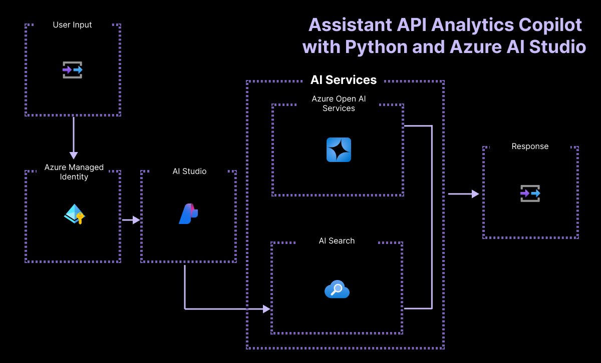

# Assistant for sales data analytics in python and promptflow

This repository implements a data analytics chatbot based on the Assistants API.
The chatbot can answer questions in natural language, and interpret them as queries
on an example sales dataset.

This document focused on instructions for **azd**. To discover how to evaluate and deploy using the Azure AI SDK, please find instructions in [src/README](src/README.md) instead.

## Features

* An implementation of the Assistants API using functions and code interpreter
* Deployment available via GitHub actions or Azure AI SDK
* An agent performing data analytics to answer questions in natural language


### Architecture Diagram




## Getting Started

### Prerequisites

- Install [azd](https://aka.ms/install-azd)
    - Windows: `winget install microsoft.azd`
    - Linux: `curl -fsSL https://aka.ms/install-azd.sh | bash`
    - MacOS: `brew tap azure/azd && brew install azd`
- An Azure subscription with [permission](https://learn.microsoft.com/en-us/azure/role-based-access-control/rbac-and-directory-admin-roles#azure-roles) to create and deploy resources - [Create one for free](https://azure.microsoft.com/free/cognitive-services)
- Access granted to Azure OpenAI in the desired Azure subscription  
  Currently, access to this service is granted only by application. You can apply for access to Azure OpenAI by completing the form at [aka.ms/oai/access](https://aka.ms/oai/access).
- Python 3.10 or 3.11 versions
- [PowerShell 7 or later](https://learn.microsoft.com/en-us/powershell/scripting/install/installing-powershell-on-windows?view=powershell-7.4&viewFallbackFrom=powershell-7.3) (Windows only)

Note: This azd template uses `gpt-35-turbo` (1106) or `gpt-4` (1106) for assistants which may not be available in all Azure regions. Check for [up-to-date region availability](https://learn.microsoft.com/azure/ai-services/openai/concepts/models#standard-deployment-model-availability) and select a location during deployment accordingly.

### Installation

1. First, clone the code sample locally:

    ```bash
    git clone https://github.com/Azure-Samples/assistant-data-openai-python-promptflow
    cd assistant-data-openai-python-promptflow
    ```

2. Next, create a new Python virtual environment where we can safely install the SDK packages:

 * On MacOS and Linux run:
   ```bash
   python --version
   python -m venv .venv
   source .venv/bin/activate
   ```

* On Windows run:
   ```ps
   python --version
   python -m venv .venv
   .venv\scripts\activate
   ```

3. Now that your environment is activated, install the SDK packages

    ```bash
    pip install -r ./src/requirements.txt
    ```

## Quickstart

## Before your start: check your quota

To ensure you have quota to provision `gpt-35-turbo` version `1106`, you can either go to [oai.azure.com](https://oai.azure.com/) and check the Quota page in a given location.

You can also try running our experimental script to check quota in your subscription:

```bash
azd auth login        # if you haven't logged in yet
python ./src/check_quota.py --subscription-id [SUBSCRIPTION_ID]
```

> Note: this script is a tentative to help locating quota, but it might provide numbers that are not accurate. The [Azure OpenAI portal](https://oai.azure.com/) and our [docs of quota limits](https://learn.microsoft.com/en-us/azure/ai-services/openai/quotas-limits) would be the source of truth.

It will show a table of the locations where you have `gpt-35-turbo` available.

```
+--------------+---------+--------+---------------+----------+-------+-----------------+
|    model     | version |  kind  |   location    |   sku    | quota | remaining_quota |
+--------------+---------+--------+---------------+----------+-------+-----------------+
| gpt-35-turbo |  0613   | OpenAI | australiaeast | Standard |  300  |       270       |
| gpt-35-turbo |  1106   | OpenAI | australiaeast | Standard |  300  |       270       |
| gpt-35-turbo |  0301   | OpenAI |    eastus     | Standard |  240  |        0        |
| gpt-35-turbo |  0613   | OpenAI |    eastus     | Standard |  240  |        0        |
| gpt-35-turbo |  0613   | OpenAI |    eastus2    | Standard |  300  |       300       |
| gpt-35-turbo |  0301   | OpenAI | francecentral | Standard |  240  |        0        |
| gpt-35-turbo |  0613   | OpenAI | francecentral | Standard |  240  |        0        |
| gpt-35-turbo |  1106   | OpenAI | francecentral | Standard |  240  |        0        |
| gpt-35-turbo |  0613   | OpenAI | swedencentral | Standard |  300  |       150       |
| gpt-35-turbo |  1106   | OpenAI | swedencentral | Standard |  300  |       150       |
| gpt-35-turbo |  0301   | OpenAI |    uksouth    | Standard |  240  |       60        |
| gpt-35-turbo |  0613   | OpenAI |    uksouth    | Standard |  240  |       60        |
| gpt-35-turbo |  1106   | OpenAI |    uksouth    | Standard |  240  |       60        |
+--------------+---------+--------+---------------+----------+-------+-----------------+
```

Pick any location where you have both `1106` and `0301`, or both `1106` and `0613`, with remaining_quota above 60.

By default, `azd provision` will use `1106` for the chat model, and `0301` for the evaluation model. To modify which version to use for the chat and evaluation models, use the env vars before running `azd provision`.

In bash:

```bash
AZURE_OPENAI_CHAT_DEPLOYMENT_VERSION="1106"
AZURE_OPENAI_EVALUATION_DEPLOYMENT_VERSION="0301"
```

or in powershell:

```powershell
$Env:AZURE_OPENAI_CHAT_DEPLOYMENT_VERSION="1106"
$Env:AZURE_OPENAI_EVALUATION_DEPLOYMENT_VERSION="0301"
```

## Step 1 : Provision the resources

Use azd to provision all the resources of this template for you:

```bash
azd provision
```
Once you complete the process, you can find `.env` file under .azure\{env} folder. Your `.env` file should look like this:

```bash
AZURE_ENV_NAME=...
AZURE_TENANT_ID=...
AZURE_SUBSCRIPTION_ID=...
AZURE_RESOURCE_GROUP=...
AZURE_LOCATION=...
AZUREAI_HUB_NAME=...
AZUREAI_PROJECT_NAME=...
AZUREAI_ENDPOINT_NAME=...
AZURE_OPENAI_ENDPOINT=...
AZURE_OPENAI_CHAT_DEPLOYMENT="chat-35-turbo"
AZURE_OPENAI_EVALUATION_DEPLOYMENT="evaluation-35-turbo"
```

It will also programmatically create an assistant in your Azure OpenAI instance. So you should expect an environment variable:

```bash
AZURE_OPENAI_ASSISTANT_ID=...
```

**Troubleshooting** - If you do not see a `.env` file at the root of the repo in the end of this process, it means the `postprovision` steps have failed. Before moving foward, do the following:

```bash
cp ./.azure/$AZURE_ENV_NAME/.env ./.env
python -m pip install -r ./src/requirements.txt
python ./src/create_assistant.py --export-env ./.env
```

### Step 2. Deploy

Use azd to create the assistant in your Azure OpenAI instance, package the orchestration code and deploy it in an endpoint.

```bash
azd deploy
```

### Step 3. Run the assistant flow locally

To run the flow locally, use `pf` cli:

```bash
pf flow test --flow ./src/copilot_sdk_flow/flow.flex.yaml --inputs chat_input="which month has peak sales in 2023"
```

You can add `--ui` to run the local test bed.

### Step 4. Run an evaluation locally

The evaluation script consists in running the completion function on a groundtruth dataset and evaluate the results.

```bash
python ./src/evaluate.py --evaluation-name assistant-dev --evaluation-data-path ./src/data/ground_truth_sample.jsonl --metrics similarity
```

This will print out the results of the evaluation, as well as a link to the Azure AI Studio to browse the results online.

## Clean up

To clean up all the resources created by this sample:

1. Run `azd down`
2. When asked if you are sure you want to continue, enter `y`
3. When asked if you want to permanently delete the resources, enter `y`

The resource group and all the resources will be deleted.

## Costs

You can estimate the cost of this project's architecture with [Azure's pricing calculator](https://azure.microsoft.com/pricing/calculator/)

- Azure OpenAI - Standard tier, GPT-4, GPT-35-turbo and Ada models.  [See Pricing](https://azure.microsoft.com/pricing/details/cognitive-services/openai-service/)
- Azure AI Search - Basic tier, Semantic Ranker enabled [See Pricing](https://azure.microsoft.com/en-us/pricing/details/search/)

## Security Guidelines

Each template has either [Managed Identity](https://learn.microsoft.com/en-us/entra/identity/managed-identities-azure-resources/overview) or Key Vault built in to eliminate the need for developers to manage these credentials. Applications can use managed identities to obtain Microsoft Entra tokens without having to manage any credentials. Additionally, we have added a [GitHub Action tool](https://github.com/microsoft/security-devops-action) that scans the infrastructure-as-code files and generates a report containing any detected issues. To ensure best practices in your repo we recommend anyone creating solutions based on our templates ensure that the [Github secret scanning](https://docs.github.com/en/code-security/secret-scanning/about-secret-scanning) setting is enabled in your repos.

To be secure by design, we require templates in any Microsoft template collections to have the [Github secret scanning](https://docs.github.com/en/code-security/secret-scanning/about-secret-scanning) setting is enabled in your repos.'

## Resources
- [Develop Python apps that use Azure AI services](https://learn.microsoft.com/azure/developer/python/azure-ai-for-python-developers)
- Discover more sample apps in the [azd template gallery](https://aka.ms/ai-apps)!
